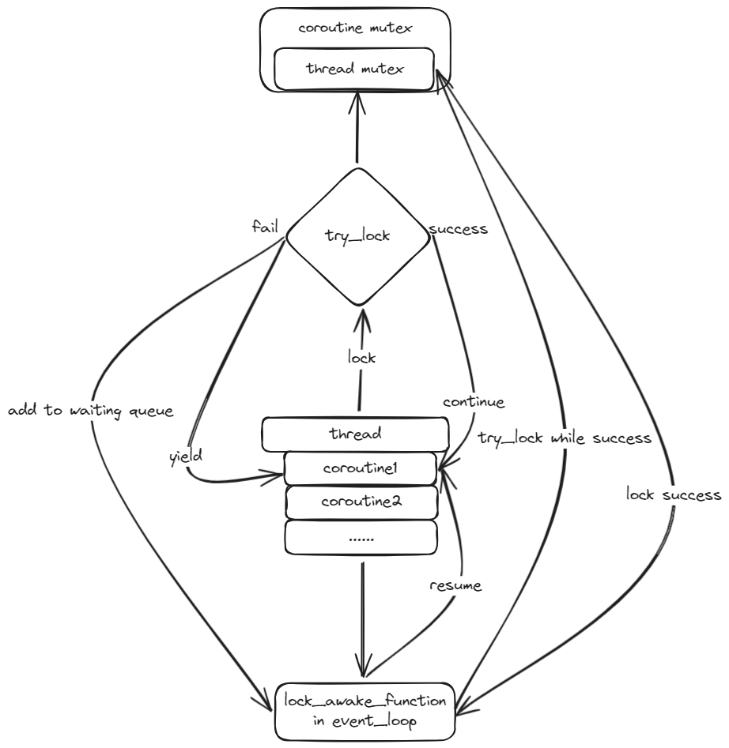

# coroutine
一个纯C实现的基于异步IO事件通知的协程框架

## 本协程库特点
1. 采用对称式协程，且每个协程有自己独立的栈。
2. 协程可嵌套、可递归，不限深度。
3. 支持协程版本的函数与系统原版函数混用，即协程并不会对其它函数的行为产生影响。
4. 类似linux多线程，协程创建后只返回一个句柄，向用户屏蔽内部结构。
5. 只需要包含一个头文件`coheader.h`。
6. 实现hook机制，开启hook后即可像使用原版函数一样使用各io相关函数，但阻塞时能自动挂起协程。
7. 使用小根堆来实现超时机制。
8. 协程创建后即投入运行，不需要手动启动，不需要手动开启事件循环，支持获取返回值，使协程的使用方式更接近linux线程。
9. 除了通用寄存器外，切换协程时还会保存浮点寄存器和标志寄存器
10. 屏蔽yield和resume等操作，通过协程版本的锁/条件变量来实现挂起等操作，使协程的使用更方便直观，更接近线程。
11. 为协程版本的锁/条件变量支持多线程

## 运行
使用`make testname`即可运行相应的test

使用`make speed`运行全部性能测例并比较

可以使用`LOG_LEVEL`环境变量指定日志级别，不指定则默认是`LOG_INFO`

比如：
```
make test_return LOG_LEVEL=LOG_DEBUG
```

## 接口
- 协程接口
```C
/*
创建协程，返回句柄;
参数func需要是一个void (*)(void*)类型的函数;
arg是一个void*指针，表示传给func的参数，可以为NULL;
stack_size是栈大小，可以用0表示由框架指定;
*/
coroutine_t coroutine_create(void (*func)( void*), void *arg, size_t stack_size);

//等待协程运行结束，获取返回值，并释放协程内存
void* coroutine_join(coroutine_t handle);

//分离协程，运行结束后自动释放内存
void coroutine_detach(coroutine_t handle);
```
- 条件变量
```C
//创建条件变量
co_cond_t co_cond_alloc();

//唤醒一个等待条件变量的协程
void co_cond_signal(co_cond_t handle);

//唤醒所有等待条件变量的协程
void co_cond_broadcast(co_cond_t handle);

//等待条件变量
bool co_cond_wait(co_cond_t handle, co_mutex_t mutex);

//等待条件变量，超时时间为ms
bool co_cond_timewait(co_cond_t handle, co_mutex_t mutex, int timeout);

//释放条件变量
void co_cond_free(co_cond_t handle);
```
- 互斥锁
```C
//创建互斥锁
co_mutex_t co_mutex_alloc();

//加锁
void co_mutex_lock();

//尝试加锁，立刻返回，成功返回0，否则返回-1
int co_mutex_trylock();

//解锁
void co_mutex_unlock();

//释放
void co_mutex_free(co_mutex_t handle);
```
- hook机制
```C
//开启hook机制
void enable_hook();

//关闭hook机制
void disable_hook();

//检查是否开启了hook
bool is_hook_enabled();

// 支持hook的函数：read,write,send,recv,sendto,recvfrom,accept,connect,setsockopt,sleep,usleep
```

## 使用
- src目录下会被编译为共享库libsrc.so，头文件包含coheader.h，链接此共享库即可使用。
- 具体用法可以看test目录下的例程。

## 测例介绍
- test_开头的为功能测例
    - test_recur测试嵌套创建
    - test_return测试嵌套创建和协程返回值
    - test_rdwr,test_read,test_sleep,test_tcp,test_timeout,test_udp测试各调用阻塞时能否正常挂起协程
    - test_cond测试条件变量
    - test_mutex测试互斥锁
- coroutine_开头的表示性能测例的协程版本，thread_开头的表示性能测例的线程版本
    - (coroutine/thread)_fib，1w线程/协程线性计算斐波那契数列，属于计算密集型，主要测试(创建/切换)的开销。
    - (coroutine/thread)_io, 1k线程/协程，使用usleep模拟io操作，主要测试自动挂起开销。
    - (coroutine/thread)_mutex，1w线程/协程原子加，主要测试互斥锁效率。
    - (coroutine/thread)_cond，1w线程/协程生产消费，主要测试条件变量效率。
    - 本地测试结果如下[性能测试结果](speed_test.txt)

## 进度
- **24.11.23**: 实现简易的单对父子协程切换功能。
- **24.11.26**: 实现先进先出协程调度器对协程进行自动调度。
- **24.11.28**: 不在事件循环里对主协程特殊处理，而是作为普通协程受调度器调度；提供开启事件循环的接口，改为手动开启事件循环。
- **24.11.30**: 添加协程调用栈的支持，为手动调度的支持做准备。
- **24.12.03**: 添加外部日志库`log.c`用于调试，尝试支持手动调度。
- **24.12.04**: 实现手动调度与自动调度混合；对用户函数进行封装使得函数退出时能自动修改`status`为`DEAD`。
- **24.12.06**: 手写汇编实现`get_context`,`set_context`以及`swap_context`用来替换`ucontext`的相关的函数，居然一次性写对了。
- **24.12.07**: 为进程调度引入`epoll`，准备实现各调用的协程版本。
- **24.12.09**: 修复`epoll`相关bug，完善基于`epoll`的协程调度，实现可自动在阻塞时让出cpu的`read`调用。
- **24.12.10**: 修复`epoll`相关bug，实现`write`调用。
- **24.12.11**: 实现`sendto`、`recvfrom`、`send`、`recv`、`accept`。
- **24.12.12**: 修复创建协程传递的参数不能为`NULL`的BUG，修复`epoll`相关bug，添加小根堆的实现，为实现超时机制做准备。完善readme文档介绍。
- **24.12.14**: 重构`wait_event`，添加之前系统调用的超时机制，添加`sleep`和`usleep`。
- **24.12.16**: 实现协程版本的`connec`t，实现协程调用栈的动态扩容。
- **24.12.18**: 在考虑协程结构体本身内存是由用户释放还是框架释放时遇到了两难，后来想到可以模仿linux线程，只给用户提供int类型的句柄，这样不但可以防止用户意外释放内存，还可以向用户屏蔽协程内部结构。实现了单头文件，现在只需要包含`coheader.h`文件即可使用。实现了hook机制。模仿linux多线程，协程创建即投入使用，无需手动启动，使用`coroutine_join`回收等待。
- **24.12.19**: 支持协程返回值；完善接口和注释。
- **24.12.20**: 修改join的机制，从轮询改为通知，减少协程切换的次数；修复对自动调度的协程调用`cancel`会发生内存泄漏的bug；添加接口用于查询协程是否结束；完善测例。
- **24.12.21**: 添加切换上下文时对标志寄存器和浮点寄存器的保存。
- **24.12.22**: 添加`detach`方法。
- **24.12.31**: 移除手动调度相关函数和字段，移除调用栈，移除对手动调度的支持。
- **25.01.11**: 添加衡量程序运行时间和峰值内存的脚本；添加比较两个程序运行时间和内存的脚本；添加一堆测试运行速度的测例。
- **25.01.13**: 将分配句柄抽象出来，以便之后条件变量复用。
- **25.01.14**: 实现协程版的条件变量（暂未支持多线程）。
- **25.01.16**: 实现协程版的互斥锁（暂未支持多线程）。
- **25.01.18**: 发现手动分配句柄存在一些弊端，需要额外的空间时间开销，且不利于多线程的配合。如果只是想要向用户屏蔽内部结构，直接把`void*`指针作为句柄即可。因此重构句柄分配相关代码，使用地址作为句柄。
- **25.01.20**: 
    - 多线程环境下，协程的互斥锁较复杂。为了帮助理清思路画了下草图，考虑过轮询/唤醒或两者结合的机制后，最终选定了如下的方案：协程锁其实是一个线程锁的封装（可以自己利用`futex`实现，也可以复用`pthread`的`mutex`）。
    - 当需要加锁时，使用线程锁的`try_lock`进行加锁，如果加锁成功，那么正常返回。如果加锁失败，则将协程和对应锁放入一个唤醒函数中（一个协程只会有一个对应的锁，但一个锁可能会有多个对应的协程，此时添加多对"锁-协程"对而非一个"锁-协程链表"，这样多次添加时不需要进行查询操作，时间上效率更高，而空间上平均每个协程也只多耗费一个指针的空间），然后`yield`出去。这个唤醒函数是一个运行在`eventloop`中的函数，他会查询自己保存的锁中是否有能成功`try_lock`的，如果是，那么则唤醒对应协程。因为每个线程都有独自的唤醒函数，所以每个唤醒函数中保存的协程都是来自同一个线程的协程，因此向唤醒函数中添加“锁-协程”对时不需要考虑并发问题。
    - 当需要解锁时，直接使用线程锁的`unlock`即可。
    - 加锁过程的流程图如下: 
    
- **25.01.23**: 为协程版互斥锁支持多线程。
- **25.01.27**: 
    - 多线程环境下，协程的条件变量更为复杂。按照一般思路，需要有一个全局队列来保存等待通知的协程，但又由于这个队列是在线程间共享的，那么则必然需要对这个队列进行一些线程同步相关的处理，增大了开销。经过几日的思索，终于想出了一个兼顾效率与安全的实现方式：将条件变量的唤醒，从通知的形式修改为查询的形式，维护少量全局的信息用于表示通知的状态，这样就不必整体维护全局的等待协程，而是每个线程各自保存自己等待中的协程即可，不需要为协程队列实现同步。
    - 条件变量由三个成员组成：一个`mutex`，用于修改`cnt_signal`时的同步；一个`cnt_signal`，用于表示`cond_signal`的状态；还有一个`cnt_broadcast`，用于表示`cond_broadcast`的状态。
    - 先介绍比较简单的broadcast: 当一个协程`cond_wait`时，它会记录此时`cnt_broadcast`的值，如果某一个时刻`cnt_broadcast`改变了，那么一定是由其他协程调用了`cond_broadcast`，那么这个协程就可以被唤醒。当一个协程调用`cond_broadcast`时，则是简单地将`cnt_broadcast`自增。这一步是不需要加锁的。因为如果多个线程同时调用`cond_broadcast`的话，虽然竞争可能会导致`cnt_broadcast`应该增加的数量减少，但是它至少会增加1（需要加`volatile`保证每次都读到最新的值），这并不影响唤醒判断的正确性(可以类比普通的条件变量，连续多次调用`cond_broadcast`跟只调用一次`cond_broadcast`的结果是一样的，都是唤醒所有协程）。
    - 之后是signal: 当一个协程`cond_wait`时，它也会记录此时`cnt_signal`的值(这一步不需要加锁)，如果某一个时刻，记录的值低于条件变量中最新的值(这一步需要加锁)，就说明已经有线程调用过`cond_signal`，那么唤醒协程，并将`cnt_signal`的值自减。这里`cnt_signal`的作用有点类似于信号量，但不完全相同。当`cond_wait`时记录此时的值，只有到条件变量中的值更大时才唤醒，保证了在`cond_wait`调用之前的`cond_signal`不会唤醒之后的协程，同时也保证了每个`cond_signal`最多只唤醒一个协程（可能唤醒0个，这就是信号丢失的情况了，与普通的`cond_signal`相同）。
    - 优先判断`cond_broadcast`，因为它不需要同步，速度更快。
    - 其中`mutex`和`cnt_signal`可以改成`atomic_int cnt_signal`，使用原子操作实现相关功能。
    - 流程图如下: 后被证实思路有误，以防误导删除了流程图，想看可以看./figure/co_cond.png
- **25.01.29**: 为协程版条件变量支持多线程。
- **25.02.03**: 为条件变量添加效率测例，协程出现了两个条件变量互相等待的死锁现象，发现是思路细节问题，需要构思解决方案。
- **25.02.04**: 修改条件变量实现方式，改用线程安全的队列来保存每个条件变量对应的协程。完善条件变量和互斥锁的效率测例。
- **25.03.04**: 当线程中没有可执行的协程时，利用阻塞的epoll_wait挂起线程，后续利用Pipe来唤醒。
- **25.03.30**: 意识到协程函数的参数类型使用const void\*不合适，不然遇到需要传递大量数据作为参数（比如数组）时不方便，因此修改回了void*类型

## Debug 记录
### 2024.11.25~2024.11.26
- 将调度方式切换为协程统一返回至事件循环，由事件循环进行resume后，当事件循环进行resume时会segment fault。调试后发现是因为为保存栈空间分配的1024B不够，改成128*1024B后成功运行。
### 2024.11.29~2024.11.30
- 添加协程调用栈的支持，遇到了segment fault，发现是因为在yield中获取当前协程时，先弹出调用栈，再获取栈顶元素导致的错误。
### 2024.12.4
- 将函数进行一次封装后，调试输出发现函数的arg参数为null。后发现是因为eventloop也调用coroutine_init进行创建，但有些操作并不适用于eventloop，因此单独实现epoll_event的初始化以解决。
### 2024.12.9
- 对于test_read，read第一次让出cpu后，协程一直在main和test_suspend之间切换，即便已经有了标准输入。调试发现是因为之前的逻辑只有在可执行协程为空时才会去检查epoll，但实际上有的可执行协程可能实在忙等待(比如此例的main)，从而永远无法调度到read。改为每次协程切换时都检查epoll后解决。
- 解决上述问题后，发现只有第一次read阻塞后能正常切换，当第二次read阻塞后就不会切换了。调试发现，read被多次加入可执行队列中，因为之前改成了每次切换协程时都检查epoll，但并没有修改epoll，导致read协程被多次添加到可执行队列。因此当read被从epoll加入到可执行队列时，需要移除对它的监听。进而想到，可能会出现多个协程监听同一个fd的不同事件的情况，这是之前没有考虑过的，因此重构epoll相关数据结构和代码逻辑，为每个文件描述符维护一个正在等待的协程队列，当某事件发生时，遍历这个文件描述符的协程队列，将等待对应事件的协程加入到可执行队列并从等待队列移除，此时如果还有其它事件需要继续监听，则修改监听事件，否则从epoll中删除这个文件描述符。
- 解决上述问题后，发现read协程还是有被多次加入可执行队列的现象。调试后发现，是因为wait_event中调用了coroutine_yield来让出cpu，但是这个操作本身就会把协程加入可执行队列。因此为协程新增了in_epoll字段，表示这个协程是否加入了epoll，如果是，那么yield时则不需要将其加入可执行队列。
### 2024.12.10
- 昨晚睡前突然想到，如果多个协程监听同一个fd的读操作，当fd可读时这些协程都会被加入可执行队列，此时如果第一个协程把fd读完了，那么它又会变回不可读，但后面的协程依旧是以为它可读，从而阻塞(其它操作同理)。想了两个方案，一个是在每次读操作之前再检查一下是否确实可读，另一个是对于同一个fd一次只唤醒一个协程。如果用前者的话，会有反复将协程加入移除epoll队列的情况，当监听同一个fd的协程较多时会浪费较多时间，所以选择了后者。
### 2024.12.11
- 运行co_recvfrom时，在本应阻塞的情况下返回了“Resource temporarily unavailable”导致没有让出cpu。调试后发现，是因为co_sendto时，需要将其改为非阻塞，但是在yield之前没有恢复阻塞，导致其它协程使用该fd时，它变成了非阻塞。在挂起之前将其改为阻塞解决。
### 2024.12.12
- 尝试把监听的事件添加上EPOLLHUP和EPOLLERR后，发现epoll不会对相应的EPOLLIN和EPOLLOUT进行响应。调试后发现，是因为epoll监听事件的删除逻辑中，是需要对应fd的events为0时才删除对应的fd的监听，但所有等待进程的响应事件的并集可能只是对应fd事件的真子集，此时等待队列为空，应该要触发fd的删除而没有删除。当再次为fd添加监听时，因为等待队列为空，所以会使用ADD来添加，但实际上这个fd的监听没有从epoll中移除，导致添加失败，实际上并没有监听EPOLLIN或EPOLLOUT。增加判断，在等待队列为空时也删除对fd的监听，问题解决。
### 2024.12.13
- 为框架添加超时机制后，自己写了个测试test_timeout，测试后发现当超时触发时，程序会segmentfault，调试后发现是事件节点多次释放的原因。原本等待队列遇到一个事件时，会把对应的事件节点释放，但添加超时机制后，这个新的节点也被超时的堆所持有。为了解决这个问题，给事件节点添加了freetimes字段，表示需要释放的次数，相当于一个简化版的针对特定情况的shared_ptr。同时还添加了valid字段，表示这个节点是否有效，当超时触发时，可以把对应节点修改为无效状态。
- 修复以上问题后，程序能多运行一会，但仍有概率段错误。调试后发现，一个Heap节点对应的co成员的值会无故发生改变，进一步调试后发现是heap_pop返回了HeapNode指针导致的，对于pop应该返回完整的拷贝，修改后解决问题。
### 2024.12.15
- 写了一个测试test_recur来测试嵌套创建功能，出现了Segmentfault，观察日志后发现是已结束的协程仍被加入了可执行队列导致的，查看代码后发现是因为协程运行结束后会先修改状态为DEAD，然后调用coroutine_yield来让出CPU。但是coroutine_yield内部会直接将状态修改为SUSPEND，从而导致eventloop没有正确移除协程。最后添加了coroutine_finish函数来用作退出协程的接口，同时这个接口也可以开放给用户使用（虽然效果跟在协程函数里直接return是一样的）。
### 2024.12.17
- 添加hook机制，发现RTLD_NEXT宏无法找到导致编译失败，但是正确包含了dlfcn.h，其中也能看到RTLD_NEXT的定义。观察代码后发现它需要在定义了__USE_GNU宏时才会启用，而本项目并没有__USE_GNU宏。查阅资料后发现，__USE_GNU宏并没有开放给用户使用，如果需要定义，则需要定义_GNU_SOURCE宏来间接开启__USE_GNU。添加_GNU_SOUCR宏后问题解决。
### 2024.12.21
- 添加对标志寄存器的保存。原本想用pushfq保存到栈上，切换上下文后再从栈上读取，但是会发生段错误。经gdb对汇编指令进行调试并查看内存，发现寄存器/内存的值均正确无误。查阅资料后得知，x86_64机器中sp要求是16字节对齐的，而我保存8个字节的标志寄存器到栈上，再经过切换上下文，导致触发了sp未对齐的问题。同时也得知，对于浮点寄存器的保存操作fxsave，也有目的地址需要16字节对齐的要求。但是调试过程中发现，程序运行过程中sp并不总是16字节对齐的，如果将这些数据保存到栈上，栈的对齐问题不方便处理，于是决定将这些寄存器也都在堆中保存，问题解决。
### 2025.1.11
- 添加了测试运行速度的测例和比较运行时间的脚本，最开始想试试10w线程和10w协程相比的效率问题，结果测例直接把服务器跑崩了。排查后发现不是协程崩了，而是线程崩了，估计是机器的内存不够支持10w线程运行吧，Hahahaha。
### 2025.1.14
- 实现了协程版本的条件变量。写了一个test_cond进行测试时，发现生产者协程只运行一次后就再也没被调度过了，调度器只运行消费者协程。调试后发现，是因为我在co_cond_wait中使用wait_event来实现超时，但是它并无法感知协程是否已经被条件变量唤醒。同时，原本的yield有一个In_epoll参数，用来判断协程是否在等待事件。这两个导致了调度器总是唤醒消费者协程。考虑到yield接口之后是会向用户屏蔽的，只会在库内部调用，我可以保证调用yield一定是阻塞等待唤醒，因此协程不需要In_epoll这个字段了，yield也不需要执行add_coroutine操作。同时，之前为了防止忙等待而改成每次切换协程就调用一次awake也可以改成只在可执行队列为空时调用awake。同时还写了一个wait_cond来代替wait_event，专用于条件变量的超市等待，问题修复。
### 2025.1.29
- 尝试实现支持多线程的条件变量，发现cond_timewait超时时会崩溃，观察日志发现，它超时时唤醒的协程名字为null。排查后发现，因为我条件变量的超时是直接复用了epoll的超时，但是epoll里面CoNode.data就固定是Coroutine*，但是在条件变量里，CoNode.data则保存的是CondPair结构体，因此读取到了错误的协程的地址。但还是想能够复用，考虑把CondPair中的Coroutine* 放到第一个成员，想当然地认为加一下强制类型转换就能把CondPair* 当Coroutine* 用了,但依旧没能找到正确的协程。一番思索后发现，这样修改应该要强制类型转换为Coroutine** 再取值，这样才能得到正确的结果。但如此一来便跟直接用data保存Coroutine *的epoll不兼容了，需要大量修改。最后放弃复用，分别写了两个超时唤醒awake_epoll_timeout和awake_cond_timeout，问题解决。
- 尝试测例test_cond，发现当cond_timewait成功时，在时间到后依旧会触发超时。原以为是超时队列未能正确跳过无效节点，但阅读这部分代码后发现并无错漏。进一步输出调试信息，发现awake_cond中存在valid和freetimes同时为0的时刻，进而发现，是成功队列未能正确跳过无效节点，到达时间后触发的超时与最近一次成功的等待并不来自于同一次cond_timeout，成功的等待唤醒的是上次已经超时的timewait调用，而超时的是这次的timewait调用，造成了看起来像是超时队列未能正确跳过无效结点的假象。在awake_cond中跳过已经超时的无效节点，问题解决。
### 2025.2.3
- 添加条件变量效率测例时出现了两个条件变量相互等待的问题，经排查，应该是部分本应该触发的signal信号被忽略，问题应该是出在cnt_signal的初值上。因为当调用cond_wait保存cnt_signal时，可能有一些已经可以唤醒的协程还未被唤醒（需要等到awake_cond被调用时才会被唤醒），这就导致cond_wait保存的值比实际应该保存的值偏大，从而忽略了部分signal信号。正在构思解决方案，目前是想办法能否提前计算出实际应该保存的值。
- 放弃了，还是用简单粗暴的无锁队列吧。
- 又考虑了下，无锁队列虽然无锁，但CAS循环等待还是会对性能产生影响，当入队阻塞时使用协程锁切换到其它协程运行应该效率更高。
